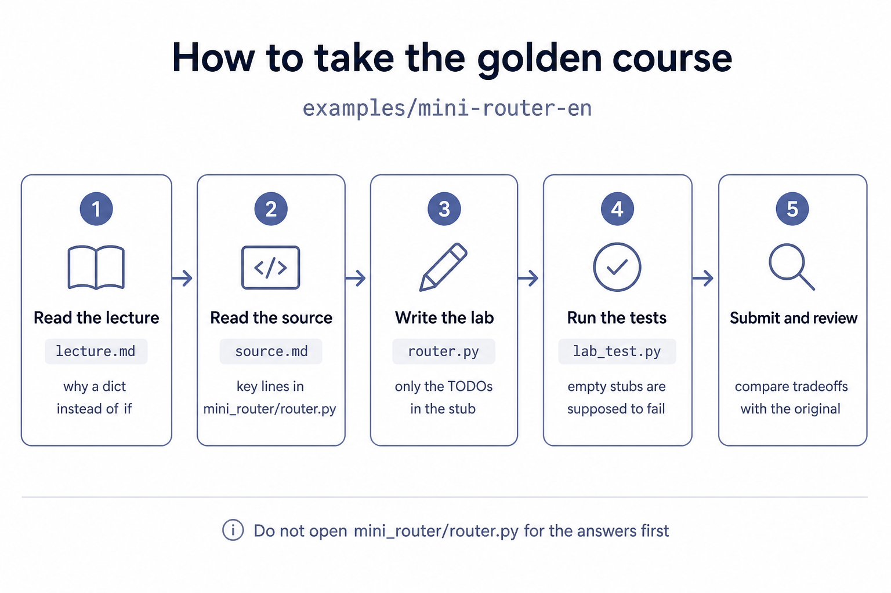
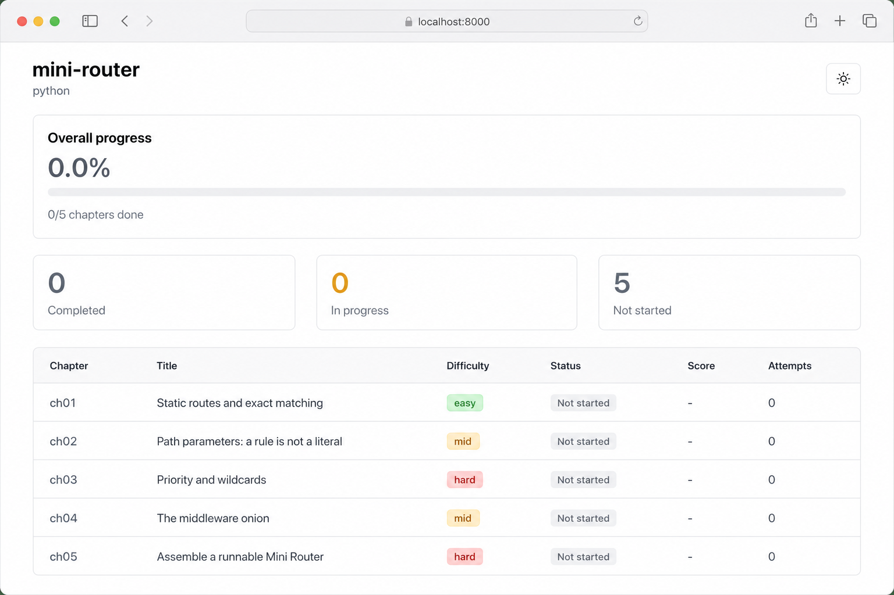
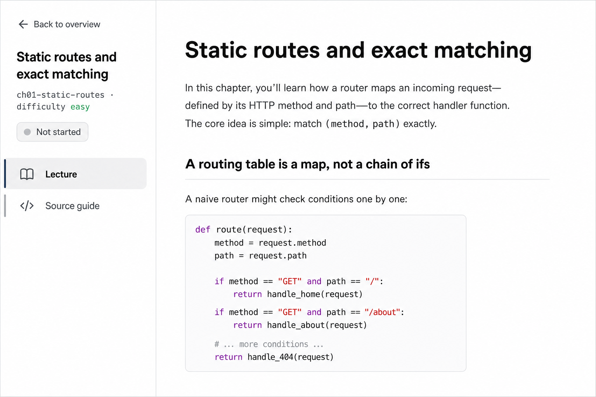
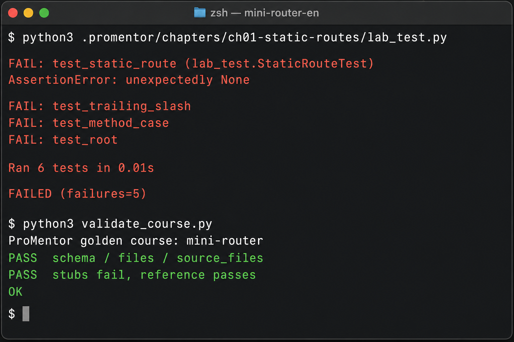

# Golden course: mini-router

[中文](../mini-router)

This is ProMentor's **golden course**. A Python HTTP router under 200 lines, with five lectures, labs, behavior tests, and student stubs.

It is also the quality bar: a course from `/promentor init` should be at least this complete — lectures explain design decisions, tests run, empty stubs fail, the reference implementation passes.

## At a glance

The loop: lecture → annotated source → write the lab → run tests → compare with the original design.



Open this directory and the course panel looks like this — five chapters, progress starts at 0:



Chapter 1: switch Lecture / Source on the left; on the right, read why a dict beats a chain of `if`s:



Empty stubs are supposed to fail. `validate_course.py` still passes: stubs must fail, the reference must pass.



## What this course teaches

| Ch | Title | Difficulty | What you implement |
|---|---|---|---|
| 1 | Static routes and exact matching | easy | `(method, path)` lookup with a dict |
| 2 | Path parameters | mid | `:id` is a rule, not `==` |
| 3 | Priority and wildcards | hard | static > param > `*wildcard` |
| 4 | The middleware onion | mid | `use` + `handle`; 404 skips middleware |
| 5 | Assemble a runnable Mini Router | hard | register a real API; `main.py` starts |

The original project lives in `mini_router/`. Treat it as someone else's source. Your code goes in `.promentor/chapters/*/router.py` (chapter 5 is `app.py`).

## Start here

```bash
cd examples/mini-router-en

# Chapter 1: read the lecture, edit the stub, run tests
python3 .promentor/chapters/ch01-static-routes/lab_test.py

# After all five chapters
python3 .promentor/main.py
```

Or open this directory in an agent that supports ProMentor:

```
/promentor learn ch01
/promentor test
```

Chapter 5's `router.py` / `server.py` are the provided reference. Do not open them while doing chapters 1–4, and do not read the answers in `mini_router/router.py` first.

## Validate the course itself

```bash
python3 examples/mini-router-en/validate_course.py
```

It passes only if:

1. `.promentor/` fields and files are complete
2. Student stubs fail the chapter tests
3. Replacing student files with `mini_router/` (and `reference/app.py` for chapter 5) makes the tests pass

## Layout

```
mini_router/                 original project (for comparison)
.promentor/                  hand-written golden course
  course.json
  progress.json
  main.py                    runnable entry for chapter 5
  chapters/ch0N-*/           lecture, source guide, lab, tests, stubs
docs/                        README screenshots
reference/app.py             chapter 5 reference used by the validator
validate_course.py
```
