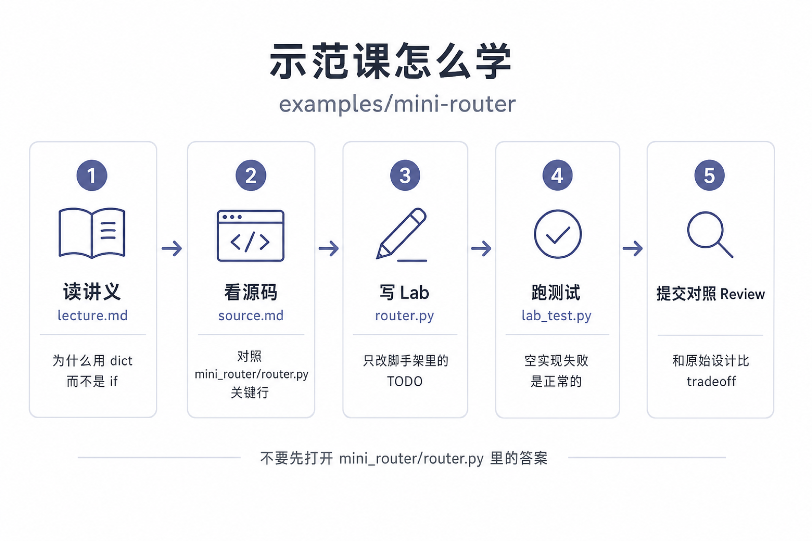
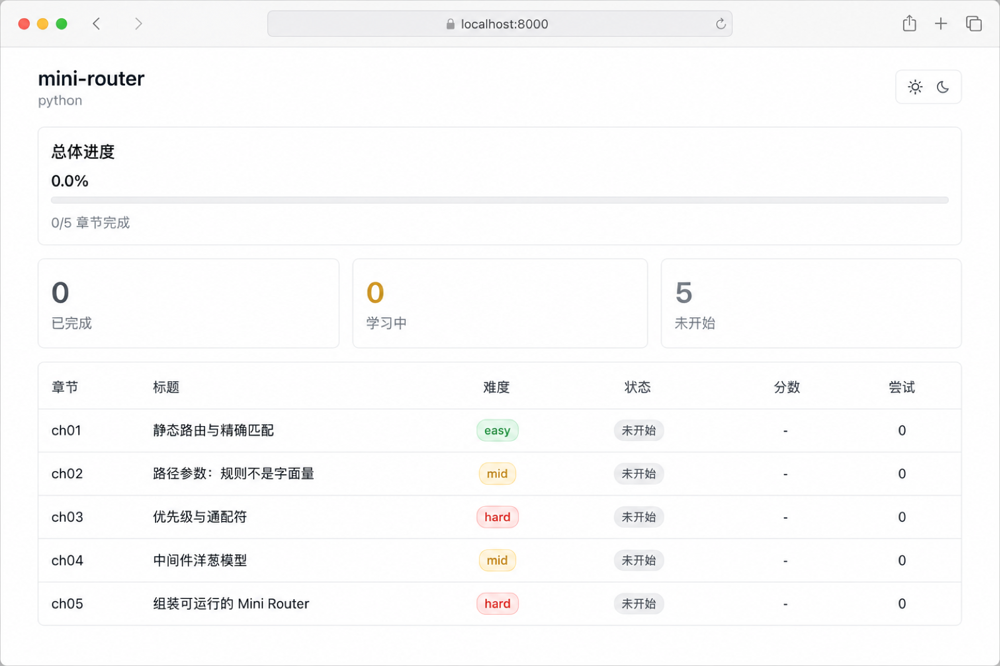
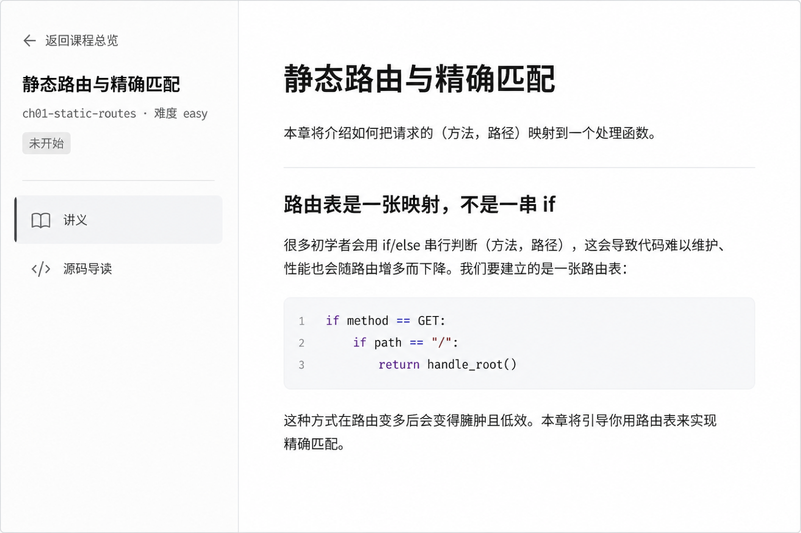
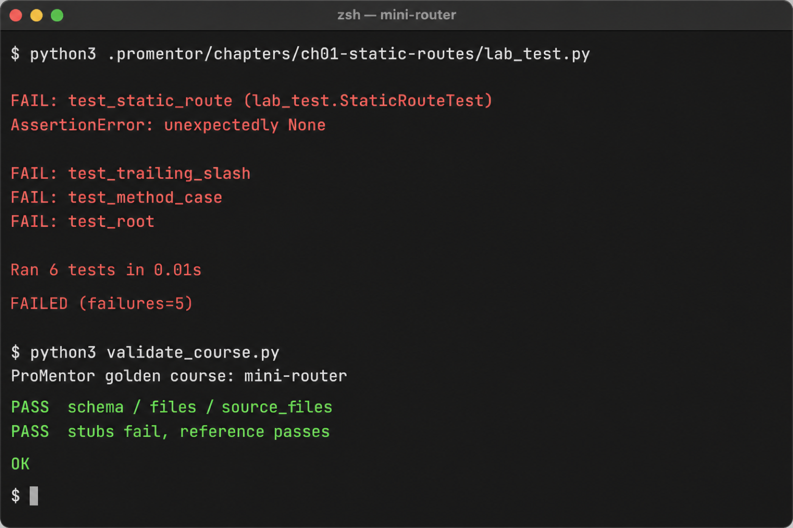

# Golden course: mini-router

这是 ProMentor 的**示范课**。一个不到 200 行的 Python HTTP 路由器，配有手写的五章讲义、Lab、行为测试和学生脚手架。

它同时是质量标尺：以后 `/promentor init` 生成的课，至少要达到这一课的完整度——讲义讲设计决策、测试能跑、空实现失败、参考实现通过。

## 一眼看懂

先看学习闭环：读讲义 → 看标注源码 → 写 Lab → 跑测试 → 对照原设计。



打开本目录后，课程面板长这样——五章都在，进度从 0 开始：



点进第 1 章，左侧切「讲义 / 源码导读」，右侧读设计决策（为什么用 dict，而不是一串 `if`）：



脚手架还是空的，测试失败是正常的。课本身用 `validate_course.py` 校验：空实现必须失败，参考实现必须通过。



## 这门课在教什么

| 章 | 题目 | 难度 | 你要写出来的东西 |
|---|---|---|---|
| Ch1 | 静态路由与精确匹配 | easy | `(method, path)` 用 dict 查找 |
| Ch2 | 路径参数 | mid | `:id` 当规则捕获，不能 `==` |
| Ch3 | 优先级与通配符 | hard | 静态 > 参数 > `*wildcard` |
| Ch4 | 中间件洋葱模型 | mid | `use` + `handle`，404 不走中间件 |
| Ch5 | 组装可运行的 Mini Router | hard | 注册真实 API，`main.py` 能启动 |

目标项目在 `mini_router/`。学习时把它当成「别人已经写好的源码」；你的实现写在 `.promentor/chapters/*/router.py`（第 5 章是 `app.py`）。

## 直接动手

```bash
cd examples/mini-router

# 第 1 章：打开讲义，改脚手架，跑测试
python3 .promentor/chapters/ch01-static-routes/lab_test.py

# 五章都做完后启动
python3 .promentor/main.py
```

或在支持 ProMentor 的 Agent 里打开本目录：

```
/promentor learn ch01
/promentor test
```

第 5 章的 `router.py` / `server.py` 是课程提供的参考实现。学前四章时不要打开它们，也先不要读 `mini_router/router.py` 里的答案。

## 校验这门课本身

```bash
python3 examples/mini-router/validate_course.py
```

通过条件：

1. `.promentor/` 字段和文件齐全
2. 学生脚手架跑测试必须失败
3. 用 `mini_router/`（和第 5 章的 `reference/app.py`）替换学生文件后，测试必须通过

## 目录

```
mini_router/                 原始项目（对照用）
.promentor/                  手写示范课
  course.json
  progress.json
  main.py                    第 5 章可运行入口
  chapters/ch0N-*/           讲义、导读、lab、测试、脚手架
docs/                        README 用的界面示意图
reference/app.py             校验器用的第 5 章参考组装
validate_course.py
```
